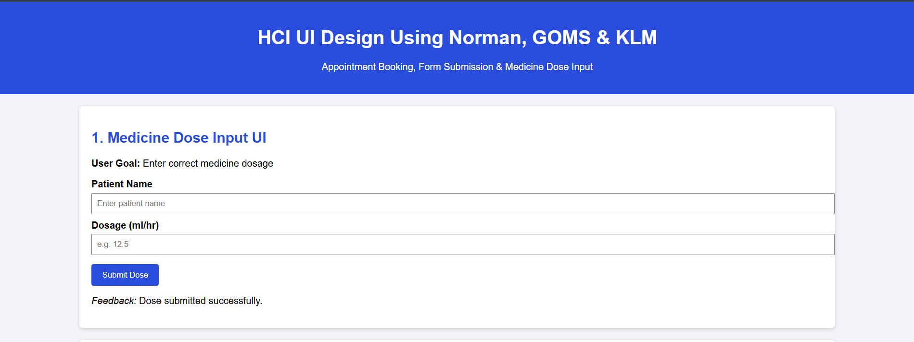
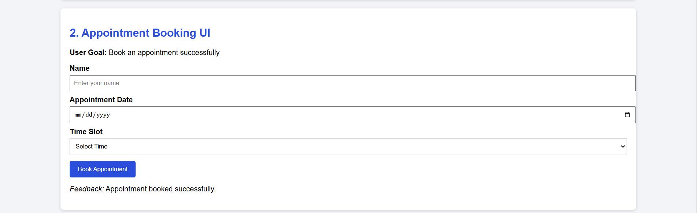
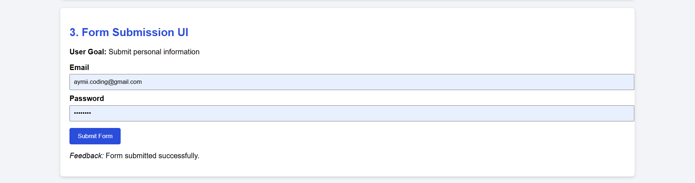

# 📘 README – HCI UI Design Assignment

### Appointment Booking, Form Submission & Medicine Dose Input

**Using Norman’s Action Cycle, GOMS & KLM Models**

---

## 1. Introduction

This project is developed as part of the **Human Computer Interaction (HCI)** course.
The main goal of this assignment is to **design simple web user interfaces** and **analyze them using HCI cognitive models**, not to focus on heavy programming.

The project demonstrates how **good UI design reduces user errors, cognitive load, and confusion** by applying well-known HCI models.

---

## 2. Objectives of the Project

The objectives of this assignment are:

* To design simple and usable web interfaces
* To apply **Norman’s Seven Stages of Action**
* To analyze user tasks using **GOMS model**
* To estimate task performance using **KLM (Keystroke Level Model)**
* To minimize **Gulf of Execution** and **Gulf of Evaluation**
* To focus on **recognition over recall**
---

## 4. User Interfaces Designed

The project contains **three real-world user interfaces**:

### 4.1 Medicine Dose Input UI

* User enters patient name and dosage
* Example domain: **Safety-critical medical system**
* Example domain: Whcih was discuss in class . Error must Zero .
* Highlights importance of correct input and clear feedback

### 4.2 Appointment Booking UI

* User books an appointment by selecting date and time
* Common real-life task with clear goals and steps

### 4.3 Form Submission UI

* User submits email and password
* Demonstrates basic interaction and feedback

Each UI is followed by **Norman, GOMS, and KLM analysis**.

### Screenshots of the Interfaces

Below are the screenshots of all three user interfaces designed for this project:

**Medicine Dose Input UI:**

**Appointment Booking UI:**

**Form Submission UI:**

---

## 5. Norman’s Seven Stages of Action (Applied)

Each interface follows Norman’s model:

1. **Goal** – What the user wants to achieve
2. **Intention** – Decision to perform an action
3. **Specify Action** – Planning the steps
4. **Execute Action** – Performing the interaction
5. **Perceive System State** – Observing system feedback
6. **Interpret** – Understanding what happened
7. **Evaluate** – Checking if the goal is achieved

. **Gulf Evaluation and Execution :** No Gap b/w User and System

✔ Clear labels and feedback reduce user confusion
✔ Helps minimize execution and evaluation errors

---

## 6. GOMS Model (Task Analysis)

The **GOMS model** is used to analyze how users complete tasks.

* **Goals**

  * Submit dose
  * Book appointment
  * Submit form

* **Operators**

  * Mouse click
  * Typing (keystrokes)
  * Selection

* **Methods**

  * Fill form → submit
  * Mouse + keyboard interaction

* **Selection Rules**

  * Expert users prefer keyboard
  * Novice users rely on mouse and visible options

GOMS helps understand **task structure and user behavior**.

---

## 7. KLM (Keystroke Level Model)

KLM is used to estimate **task completion time**.

Operators used:

* **K** – Keystroke
* **P** – Pointing
* **B** – Button press
* **M** – Mental preparation

Each UI includes a **KLM table** showing:

* Step-by-step actions
* Corresponding operators

This helps predict **efficiency and usability** of the interface.

---

## 8. HCI Design Principles Followed

The following principles are applied throughout the project:

* **Recognition over Recall**
  (Visible labels, placeholders, options)

* **Low Cognitive Load**
  (Minimal inputs, single main task)

* **Clear Feedback**
  (Success messages after actions)

* **Consistency**
  (Same layout and interaction style)

* **Error Prevention**
  (Simple forms, clear input fields)

---

## 11. Owner

**Name:** Ahmed Abbbasi B23110006007
**Course:** Human Computer Interaction
**Assignment:** UI Design using HCI Models
